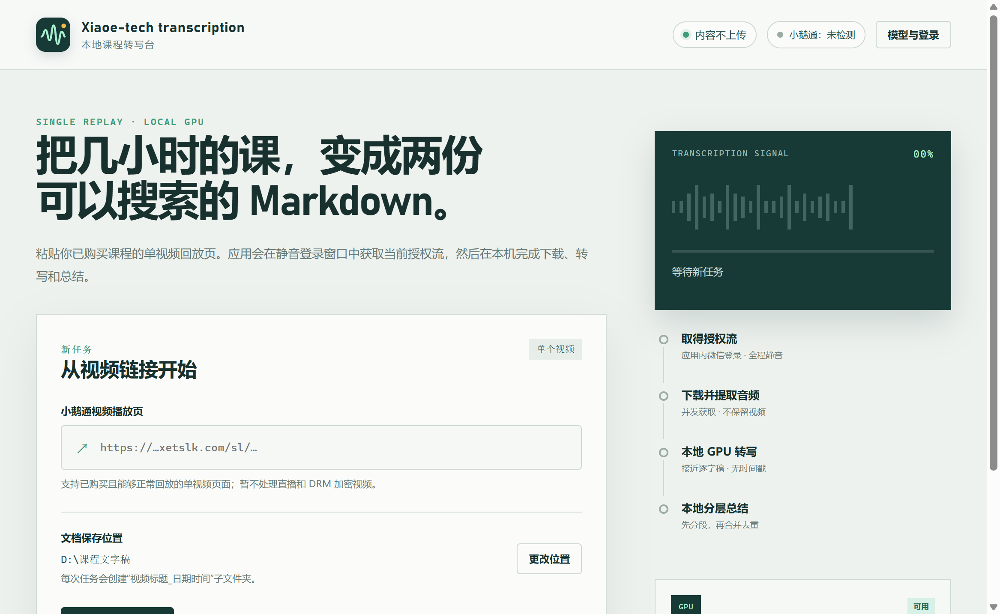

# Xiaoe Transcriber

一个面向 Windows 的本地开源工具：把本人已合法购买、当前账号有权回放的小鹅通单视频页面，转换成一份接近逐字稿的 Markdown 和一份内容总结 Markdown。

课程音频、文字稿和总结都在本机处理，不调用云端转写或大模型 API。应用不会绕过购买权限、DRM 或加密 HLS。



## 功能

- 主界面打开前验证小鹅通账号学习中心会话；首次使用直接显示账号级微信登录页
- 登录一次后按课程静默兑换目标店铺会话，可处理同一账号有权限的不同普通店铺课程
- 登录状态由 Chromium 使用 Windows DPAPI 持久化，退出登录前不会复制或导出 Cookie
- 监听当前已授权页面产生的临时 HLS 回放地址
- 登录窗口和媒体处理全程静音，不需要按视频原速播放
- 自动选择最低带宽但音轨完整的 HLS 清晰度，分片并发下载
- 自动检测显卡、显存和系统内存，在 Whisper Small、Medium、Large v3 Turbo 中推荐合适模型
- 每个转写模型可独立下载并共存；已安装模型可随时切换或删除，共用引擎只下载一次
- 模型下载支持随时暂停，继续下载会从已下进度断点续传；也可取消下载并自动清理临时文件
- 总结模型提供 Qwen3-8B 与 Qwen2.5-1.5B 两档，按显存自动推荐，可随时切换
- 工作台明确显示当前转写模型和总结模型；任务运行时显示该任务实际使用的模型
- 任务运行中仍可进入设置页并修改模型或存储位置；当前任务固定使用启动时的设置，新设置从下一次任务生效
- 使用 `whisper.cpp` + NVIDIA CUDA 生成接近逐字稿的简体中文文本（繁体输出会自动转换）
- 转写前先经 Silero VAD 过滤静音与音乐段，避免无人声片段产生幻觉文本
- 使用 `llama.cpp` 在本机做归纳式总结，再进行三轮语义质询与修正和一次只读终审
- 完整文字稿按自然段保留起止时间，便于定位原视频内容
- 总结先识别主题，再按讲解时长、强调强度与信息密度动态分配篇幅
- 总结使用带时间范围的主题标题，重点保留讲师的推理链、方法、步骤、数字和限定条件
- 报名优惠等课程通知独立整理，保留可执行细节但不挤占正文主题篇幅
- 总结中的数字、日期、金额和比例会对照对应原文自动校正；终审仍有争议的陈述会在文末按视频时间标注风险
- 逐字稿自动清理独立口头语气词，并按句子边界自然分段
- 模型目录与文档目录分别设置；每次任务创建带日期时间的新文件夹
- 工作台最多保存 100 条转写记录，点击记录可打开对应结果文件夹
- 转写任务完成后播放一声本地合成提示音，可在设置页开启或关闭
- 启动时自动检查 GitHub Releases；发现新版本安装包后在右上角显示"发现新版本"按钮，点击即可下载安装包并自动运行升级，设置页也提供"检查更新"入口
- 所有运行引擎和模型使用固定版本与 SHA-256 校验

输出结构：

```text
用户选择的目录/
└─ 视频标题_20260819_213045/
   ├─ 总结.md
   └─ 完整文字稿.md
```

## 系统要求

- Windows 10 或 Windows 11，x64
- NVIDIA 显卡；第一版不支持 AMD GPU 或纯 CPU 模式
- 建议 6 GB 以上显存，已在 RTX 4060 Laptop 8 GB 上验证
- 较新的 NVIDIA 驱动（需自行安装；Windows 更新通常会自带）
- Microsoft Visual C++ 2015–2022 Redistributable（x64）：首次启动时应用会自动检测，缺失时自动下载并请求 UAC 授权安装
- 首次下载量取决于所选模型组合：共用组件（引擎与语音检测模型）约 1.5 GB，Whisper Small/Medium/Large 约 0.5/1.5/1.6 GB，总结模型 Qwen3-8B 约 5 GB、Qwen2.5-1.5B 约 1.1 GB
- 最大模型方案安装后约占 10 GB；已安装的共用组件不会重复下载
- 视频下载阶段需要足够的临时磁盘空间

## 安装与使用

1. 从 GitHub Releases 下载最新的 `Xiaoe-Transcriber-Setup-*.exe` 和 `SHA256SUMS.txt`，核对安装包的 SHA-256 后再运行。
2. 通过安装向导完成安装；安装器会创建桌面快捷方式。
3. 首次启动时，在登录页右侧使用微信登录小鹅通账号学习中心；不需要先提供某个店铺的视频链接。
4. 扫码成功后进入设置页。此后粘贴账号有权访问的不同普通店铺课程时，应用会通过小鹅通学习中心静默建立目标店铺会话，无需逐店扫码。应用同时自动检测 NVIDIA 显卡、显存和系统内存，并标出推荐模型。
5. 分别确认模型目录和文字稿目录。检测到 D 盘时，模型默认保存在 `D:\Xiaoe-Transcriber\Models`。
6. 在设置页分别选择转写模型和总结模型：点击未安装的模型行，确认下载量后自动开始下载；下载中可随时暂停（继续时从断点接着下）、取消或同时下载其他模型；已安装的模型点击即切换使用。可以安装多个模型共存，不再需要的非当前模型可点行内“删除”释放空间。安装包本身不包含模型，也不会在安装应用时自动下载模型。
7. 每个下载文件都会进行 SHA-256 校验；解压完成后还会启动三个本地引擎做自检。VC++ 运行库缺失时按界面提示安装并在 UAC 弹窗中授权。
8. 进入工作台，确认当前转写模型和总结模型，粘贴单视频回放页链接并开始转写。应用会解析短链接、复检账号会话并静默兑换对应店铺会话。任务运行期间可以继续进入设置页修改配置；当前任务不受影响，新配置从下一次任务开始使用。为避免破坏运行中的任务，该任务正在使用的模型需等任务结束后才能删除。
9. 完成后可直接打开结果文件夹；历史转写也会保留相同入口。

账号登录过期后，应用会重新显示账号学习中心的微信登录页。自动换店失败时会显示官方学习中心作为回退，用户可点击目标课程或所属店铺继续授权，不需要重新扫码。

同名视频再次处理时不会覆盖旧文件，而是创建新的日期时间文件夹。

## 当前限制

- 只支持单个视频回放页，不支持整套课程批处理。
- 不处理正在进行的直播。
- 普通店铺可通过账号学习中心自动换店；企学院等官网本身不支持跳转的课程仍需使用对应官方 PC 学院。
- 直播群组等协作课程会在官方 gateway 完整走完中转登录后，于同一窗口确认目标课程，避免店铺登录页循环。
- 无效或已失效的分享短链会立即停止，并提示重新复制最新链接。
- 检测到 DRM、AES 加密 HLS 或暂不支持的媒体格式时会停止。
- 页面结构和接口由小鹅通控制；平台更新后可能需要适配。
- 未签名安装包可能触发 Windows SmartScreen。请从本仓库 Release 下载，并核对 Release 中的 SHA-256。
- 自动总结默认推荐 Qwen3-8B 本地模型（约 5GB 下载，建议 8GB 显存以完整载入，低显存可选 1.5B 档）；三轮质询、数字校正和终审风险提示只能降低误述概率，仍不适合作为无需人工复核的高精度出版稿。

## 隐私与安全边界

- 渲染页面启用上下文隔离，不能直接访问 Node.js。
- 登录 Cookie 只保存在 Electron 的持久化浏览器分区中，不导出到应用设置或日志。
- 应用设置只保存在本机 `settings.json`（输出目录、模型目录、所选模型、上次回放页链接、提示音开关），不包含账号凭据；回放页链接只用于工作台下次预填，账号登录验证不依赖该链接。
- 店铺用户标识只在小鹅通学习中心页面内部参与 gateway 请求；临时 gateway 地址只在内存中使用，不写入设置、历史或日志。
- HLS 签名地址只在任务内存中使用，不写入结果文件和日志。
- 下载器只接受小鹅通相关 HTTPS 域名的入口链接。
- 第三方二进制和模型来自固定官方地址并强制校验 SHA-256。
- 繁简转换词表内嵌自 OpenCC（Apache-2.0），仅用于把转写结果规范为简体中文。
- 取消或完成任务后会清理临时媒体和音频；不会保留完整视频。

本工具只应用于你本人拥有合法访问权、且使用行为符合平台协议与当地法律的内容。请勿传播课程文字稿或利用本工具侵犯版权。

## 本地开发

需要 Node.js 24+、npm 和 ImageMagick（仅在重新生成 Windows 图标或安装向导位图时需要）。

```powershell
npm install
npm test
npm run check
npm start
npm run verify:auth -- <课程链接1> <课程链接2>
npm run build:icon
npm run build:installer-art
```

`verify:auth` 会实际打开目标课程并校验 HLS 回放清单，但不会下载完整视频或启动转写。

应用启用了单实例限制。若 `npm start` 后出现的不是当前源码版本，请先退出电脑上已经运行的 Xiaoe Transcriber，再重新启动开发版本。

构建 NSIS 安装包：

```powershell
npm run dist
```

生成文件位于 `dist/`。运行引擎和模型不会被打进安装包；用户在设置页选择目录和模型后才会开始下载。

## 目录结构

```text
src/main/       Electron 主进程、授权流捕获和本地处理管线
src/renderer/   桌面界面
assets/         应用图形资源和固定依赖清单
test/           不接触真实账号的单元测试
scripts/        构建与本地验证脚本
```

总结稿的生成、数字校正、三轮质询和风险收口规则见 [总结管线说明](docs/summary-pipeline.md)。依赖来源、版本、许可证见 [THIRD_PARTY_NOTICES.md](THIRD_PARTY_NOTICES.md)。安全问题请参阅 [SECURITY.md](SECURITY.md)。

## License

[MIT](LICENSE)
